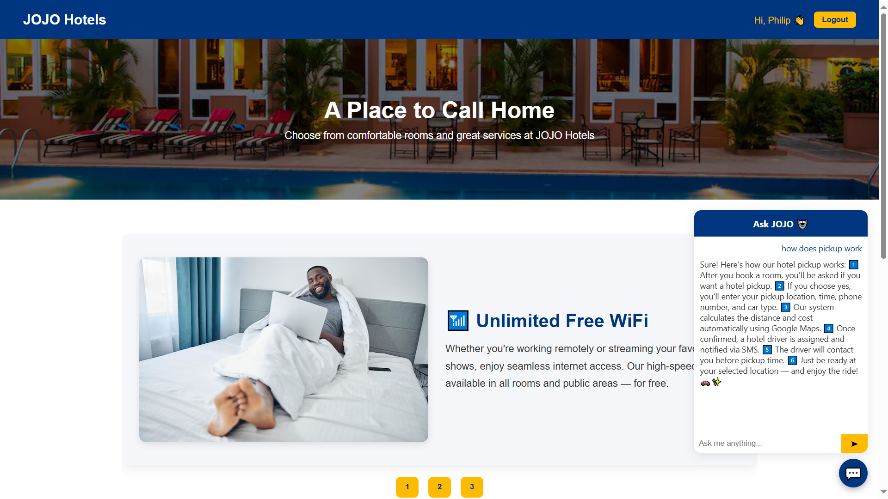
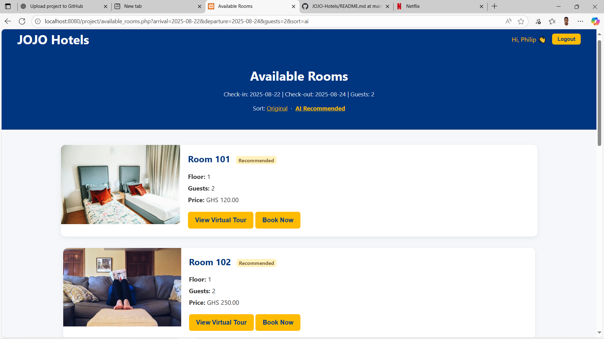
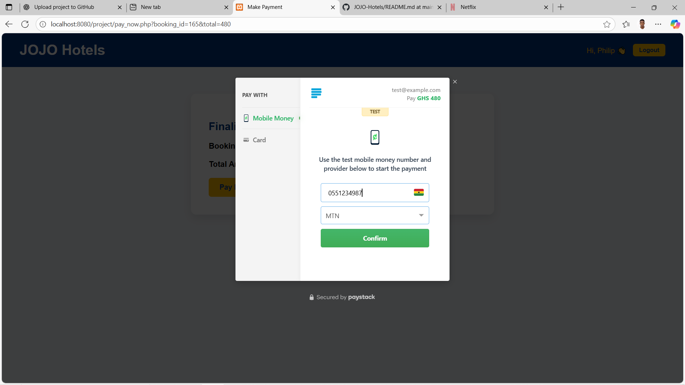
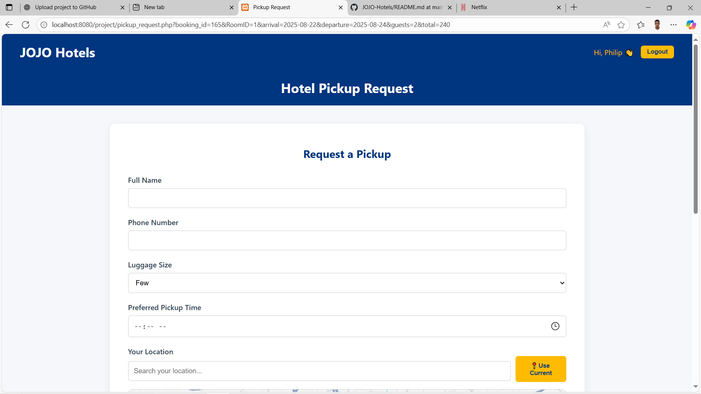
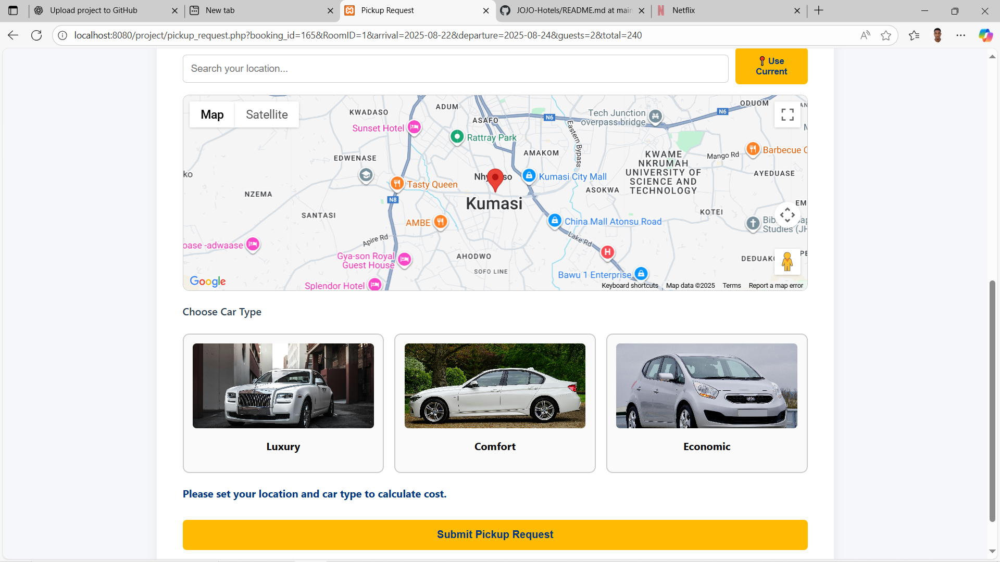
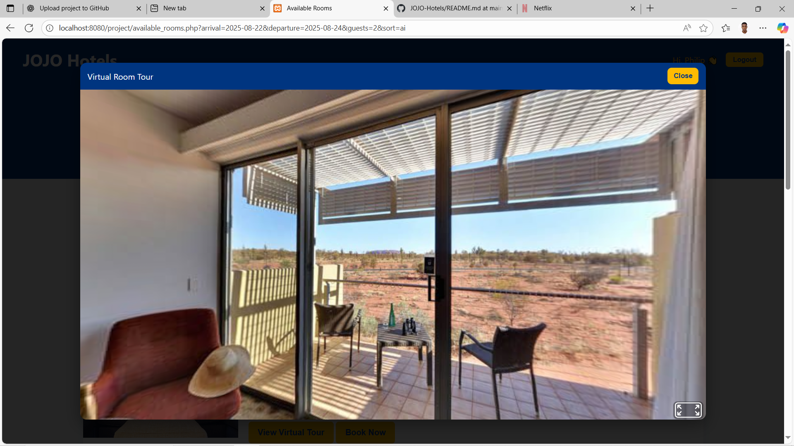
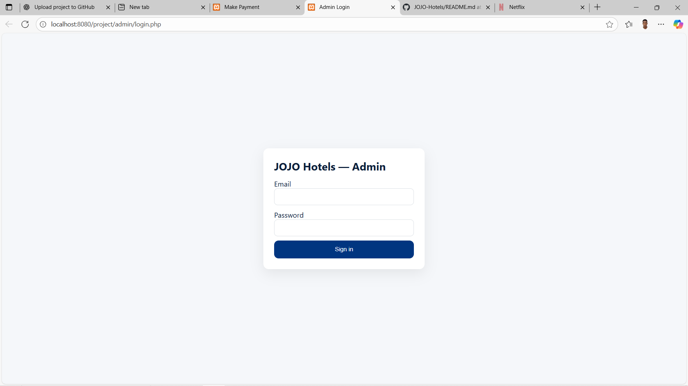
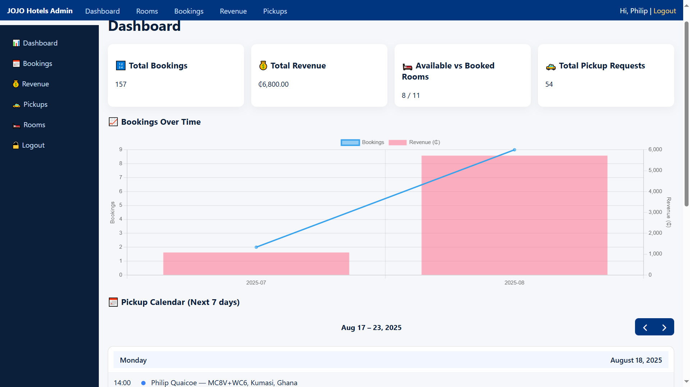
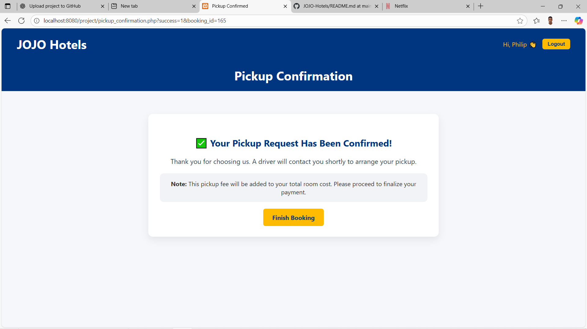
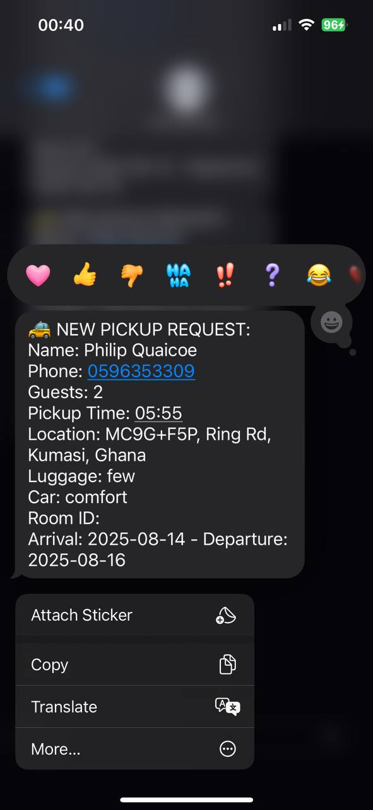

JOJO Hotels – Booking System
============================

A complete hotel booking and management system built with PHP and MySQL.  
The project includes AI-powered room recommendations, chatbot support, virtual room tours, hotel pickup with Google Maps API, Paystack payment integration, and an admin dashboard with analytics.

------------------------------------------------------------

Features
--------

Customer
- Room search and availability by date and number of guests
- AI-powered room ranking that learns from clicks and bookings
- Chatbot support for FAQs, booking guidance, and policies
- Virtual room tours for immersive 360° viewing of hotel rooms
- Booking flow with receipts and summaries
- Pickup requests with distance and cost calculated in real time
- Paystack checkout for secure payments

Admin
- Dashboard with KPIs (bookings, revenue, occupancy, pickups)
- Manage rooms, bookings, and pickup requests
- Monitor payments and system activity
- Review chatbot transcripts and feedback

------------------------------------------------------------

Tech Stack
----------

Backend: PHP 8+, MySQL  
Frontend: HTML5, CSS3, JavaScript  
APIs and Services:  
- Paystack (Payments)  
- Google Maps API (Distance and pickup cost calculation)  
- Africastalking (SMS notifications)  
AI: Multi-armed bandit algorithm for recommendations  
Virtual Tours: Embedded 360° viewing using JavaScript libraries or external viewer integration

------------------------------------------------------------

Setup (Local)
-------------

1. Clone the repository into your htdocs folder:

   git clone https://github.com/<your-username>/jojo-hotels.git

2. Import jojohotelsDB.sql into MySQL

3. Copy config.example.php to config.php and add your credentials:
   - Database (DB_HOST, DB_NAME, DB_USER, DB_PASS)
   - PAYSTACK_PUBLIC, PAYSTACK_SECRET
   - GOOGLE_MAPS_KEY
   - AFRICASTALKING_API_KEY
   - CHATBOT_API_KEY (if using AI chatbot)

4. Run the application:

   http://localhost/jojo-hotels/home.php

------------------------------------------------------------

Screenshots
-----------

Homepage

Room Listings

Availability Check

Booking and Payment

Pickup Request

Virtual Room Tour

Admin Login

Admin Dashboard

Driver Notifications

 

Author
------

Philip Quaicoe – Final Year Computer Science Student
